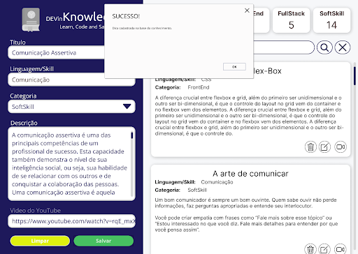
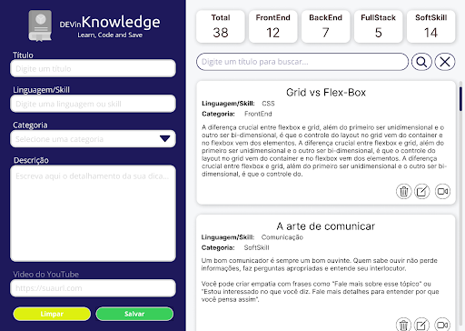
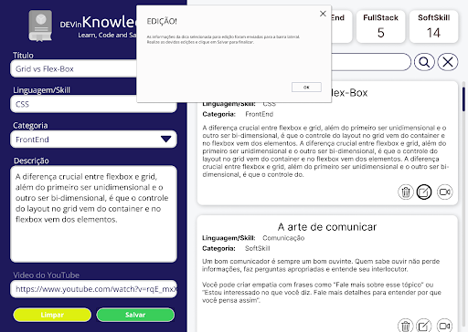
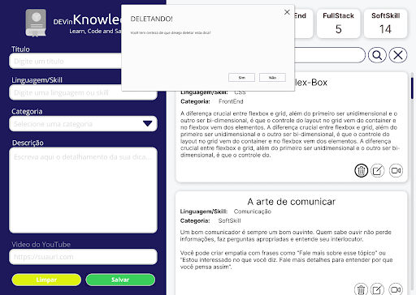
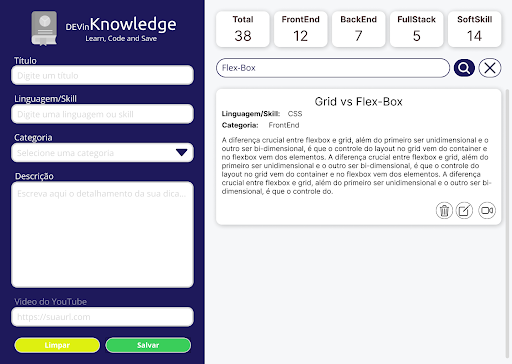

# projeto1

# h1 DEVinHouse

# Módulo 1 - Projeto Avaliativo 1

## INTRODUÇÃO

A **M1P1 Software House Ltda** está contratando novos desenvolvedores para o seu quadro de colaboradores, com o intuito de expandir os negócios. Os gestores entendem que com a chegada dos novos funcionários, será necessário realizar um onboarding contínuo para que todos fiquem em sintonia. Para isso, foi solicitado a criação de um sistema de **Base do Conhecimento**, com objetivo de manter as dicas e padronização da programação em um único lugar de fácil acesso para todos. É hora de ficar feliz, pois você foi escolhido para criar o **DEVinKnowledge**.

## REQUISITOS DA APLICAÇÃO

A aplicação que deverá ser realizada **individualmente** deve contemplar os seguintes requisitos:

1. Um título na aba do navegador, para que o usuário encontre a sua aplicação no meio das várias abas que constantemente mantém abertas;
2. Um cabeçalho dentro da página, para que o usuário saiba facilmente em que página se encontra e do que se trata o conteúdo;
3. Um formulário para que o usuário cadastre a dica, contendo:

- Título:

* Preenchimento: Obrigatório
* Tipo de campo: Input
* Mínimo de caracteres: 8
* Máximo de caracteres: 64

- Linguagem/Skill:

* Preenchimento: Obrigatório
* Tipo de campo: Input
* Mínimo de caracteres: 4
* Máximo de caracteres: 16

- Categoria:

* Preenchimento: Obrigatório
* Tipo de campo: Input Dropdown

- Pré-Cadastrado: FrontEnd, BackEnd, FullStack e Comportamental/Soft
- Descrição:

* Preenchimento: Obrigatório
* Tipo de campo: Input Text Area
* Mínimo de caracteres: 32
* Máximo de caracteres: 512

- Vídeo do YouTube:

* Preenchimento: Opcional
* Tipo de campo: Input
* Caracteres: Validar URL
* Botões de ação:

- Botão Salvar para cadastrar caso as regras sejam atendidas
- Botão Limpar para limpar os campos do formulário

4. Cards indicativos que mostram ao usuário as estatísticas do sistema. Devem apresentar a quantidade total de dicas cadastradas e a quantidade de dicas para cada categoria.
5. Uma barra de busca para que o usuário consiga pesquisar por uma dica através de seu título. Botões para pesquisar e limpar podem ser utilizados.
6. Uma lista de dicas contendo todas as informações cadastradas.

- Usar cards para agrupar as informações.
- Adicionar botão para deletar a dica.
- Adicionar botão para editar a dica.

* Ideia: Quando clicado pode carregar o formulário de cadastro para edição, facilitando a codificação do sistema.

- Adicionar botão para abrir o vídeo com a dica

* Ideia: Quando não houver vídeo cadastrado, o botão pode desaparecer do card.

7. Utilização do alert para informar as ações realizadas. Por exemplo: Dica Cadastrada, Dica Deletada e etc
8. Mensagens de confirmação, via prompt para as ações realizadas. Por exemplo: "Você realmente deseja deletar essa dica?"
9. Lógica de programação para manipulação dos dados inseridos em um array json com salvamento em localStorage (ou json-server se achar necessário).

## ROTEIRO DA APLICAÇÃO

A aplicação deverá conter os requisitos apresentados anteriormente, sendo codificada em html, css, javascript e markdown (para o readme.md). As imagens a seguir demonstram exemplos da aplicação que deverá ser desenvolvida.

Você não precisa seguir exatamente o mockup apresentado nas imagens anteriores. Você está livre para usar a sua criatividade na construção da aplicação, desde que seja realizada individualmente e que contemple todos os requisitos da aplicação.

MockUp na Ferramenta Figma:
<https://www.figma.com/file/xpVRhIUaE6P5kg8YNTC7g6/DEVinKnowledge?node-id=0%3A1>

## CRITÉRIOS DE AVALIAÇÃO

A tabela abaixo apresenta os critérios que serão avaliados durante a correção do projeto. O mesmo possui variação de nota de 0 (zero) a 10 (dez) como nota mínima e máxima, e possui peso de **40% sobre a avaliação do módulo**.
Serão **desconsiderados e atribuída a nota 0 (zero)** os projetos que apresentarem plágio de soluções encontradas na internet ou de outros colegas. Lembre-se: Você está livre para utilizar outras soluções como base, mas **não é permitida** a cópia.

|  Nº |                                            Critério de Avaliação                                            |                                                                  0                                                                   |                                                                                                           0,25 a 0,50                                                                                                           |                                                                                                                                                                                                             0,75                                                                                                                                                                                                              |
| :----: | :---------------------------------------------------------------------------------------------------------: | :----------------------------------------------------------------------------------------------------------------------------------: | :-----------------------------------------------------------------------------------------------------------------------------------------------------------------------------------------------------------------------------: | :---------------------------------------------------------------------------------------------------------------------------------------------------------------------------------------------------------------------------------------------------------------------------------------------------------------------------------------------------------------------------------------------------------------------------: |
|   1    |                O código da aplicação está organizado, indentado e é de fácil identificação?                 |                            O código da aplicação não está organizado ou indentado, é de difícil leitura.                             |                                                                O código está dividido em ao menos 3 arquivos, um para HTML, um para CSS e um para o Javascript.                                                                 |                                                                                                             O código está organizado em diferentes arquivos, está indentado e podemos identificar facilmente onde está implementada cada funcionalidade pois usa nomes descritivos para suas variáveis e funções.                                                                                                             |
|   2    |                      A aplicação faz uso das estruturas básicas de um documento HTML?                       |     A aplicação não apresenta título de aba ou não apresenta ícone de favorito ou não apresenta um título de nível 1 na página.      |                                                            A aplicação possui favicon, título de aba e cabeçalho de nível 1. Utilizando os elementos HTML adequados.                                                            |                                                                                                                     Além da aplicação possuir favicon, título de aba e cabeçalho de nível 1, também estão incluídos os metadados de língua da página, character encoding e escala do viewport adequados.                                                                                                                      |
|   3    |                      A aplicação faz uso de elementos de formulário de forma adequada?                      |                   A aplicação não possui um formulário com campos que permitam preenchimento de dados de um item.                    |                                       A aplicação possui um formulário, com campos para alguns dos dados necessários para o cadastro de um item. Utilizando os elementos HTML adequados.                                        |                                           A aplicação possui um formulário completo, com campos para todos os dados necessários para o cadastro de um novo item. Também, cada campo possui seu respectivo rótulo de identificação e um placeholder para auxiliar o usuário. Ao final existe um botão de nome “Limpar” que, ao ser pressionado, apaga todos os dados do formulário.                                            |
|   4    | A aplicação faz uso de elementos de apresentação de conteúdo como listas, cabeçalhos, parágrafos e âncoras? | A aplicação não apresenta uma lista de itens bem delimitados ou faltam informações básicas que permitem distinguir um item do outro. |                    A aplicação apresenta uma lista com o título dos itens bem delimitados e suas informações podem ser facilmente identificadas. (se necessário, itens podem ser inseridos direto no código)                    |                                                                       A aplicação apresenta uma lista com o título, a linguagem e a categoria de cada item bem delimitado e suas informações podem ser facilmente identificadas. Também, cada item possui respectivamente um botão que abre o link cadastrado em uma nova aba (caso o item tenha link).                                                                       |
|   Nº   |                                            Critério de Avaliação                                            |                                                                  0                                                                   |                                                                                                           0,25 a 0,50                                                                                                           |                                                                                                                                                                                                          0,75 a 1,00                                                                                                                                                                                                          |
|   5    | A aplicação permite o cadastro de novos itens e faz uso de variáveis que permitem o armazenamento de dados? |         A aplicação não permite o cadastro de novos itens ou não faz uso de variáveis destinadas ao armazenamento de dados.          | A aplicação permite a inserção de novos itens na lista através do acionamento de um botão de nome “Salvar”. Ao salvar um item, utilizando os dados dos campos do formulário, este item é exibido na lista de itens cadastrados. | A aplicação permite a inserção de novos itens na lista através do acionamento de um botão de nome “Salvar”. Ao salvar um item, utilizando todos os campos do formulário, o item é então inserido e exibido na lista e suas informações correspondem exatamente aos dados preenchidos nos campos. Após salvar um item, o formulário tem seus campos limpos, tornando-os prontos para receberem as informações de um novo item. |
|   6    |         A aplicação permite a remoção de itens cadastrados na lista através de um botão de remoção?         |                         A aplicação não permite a remoção de itens da lista através de um botão de remoção.                          |                                                               A aplicação apresenta um botão de remoção para cada item, mas o botão não realiza a ação esperada.                                                                |                                                                                                                  A aplicação apresenta um botão de remoção para cada item da lista, bem identificado e que, ao ser pressionado, remove o item relacionado da lista e da variável de controle do javascript.                                                                                                                   |
|   7    |          A aplicação permite a edição de itens cadastrados na lista através de um botão de edição?          |                          A aplicação não permite a edição de itens da lista através de um botão de edição.                           |                                                                A aplicação apresenta um botão de edição para cada item, mas o botão não realiza a ação esperada.                                                                |                                                             A aplicação apresenta um botão de edição para cada item da lista, bem identificado e que, ao ser pressionado, os valores do item são apresentados no formulário de cadastro. Ao clicar no botão “Salvar”, os valores (do item) devem ser atualizados na lista (não deve ser adicionado um item novo).                                                             |
|   8    |                        A aplicação salva os itens da lista na memória do navegador?                         |                                 A aplicação não salva a lista com os itens na memória do navegador.                                  |                                                                 A aplicação salva a lista na memória do navegador toda vez que o botão “Salvar” é pressionado.                                                                  |                                                                                                      A aplicação salva a lista na memória do navegador sempre que é realizada qualquer alteração na lista. Sempre que um item for inserido, removido ou atualizado, a lista atualizada é salva na memória do navegador.                                                                                                       |
|   9    |                   A aplicação carrega os dados da lista a partir da memória do navegador?                   |                             A aplicação não carrega os dados da lista a partir da memória do navegador.                              |                                                      A aplicação carrega os dados da lista salva na memória do navegador quando é clicado um botão (ex. "Recuperar lista”)                                                      |                                                                                      A aplicação carrega automaticamente os dados salvos na memória do navegador assim que a aplicação é aberta (caso existam dados salvos). Sem a necessidade de um botão. Os itens da lista obedecem a mesma ordem de quando a aplicação foi fechada.                                                                                       |
|   10   |                       A aplicação permite filtrarmos os itens cadastrados por título?                       |                                   A aplicação não permite filtrarmos os itens da lista por título.                                   |                        A aplicação apresenta na interface o campo de texto e dois botões (um para realizar a busca e um para limpar o campo do filtro), mas não executa a filtragem dos itens da lista.                         |                                               A aplicação apresenta um campo de texto para que possamos digitar algum termo e, ao clicarmos no botão de buscar, a lista de itens deve exibir apenas os itens cujos títulos possuem alguma substring similar ao termo digitado no campo de busca. Ao clicar em limpar, o campo deve ser esvaziado e os todos os itens exibidos.                                                |
|   11   |           A aplicação exibe as estatísticas de quantos itens de cada categoria estão cadastrados?           |                     A aplicação não exibe as estatísticas de quantos itens de cada categoria estão cadastrados.                      |                                              A aplicação exibe a lista de categorias existentes, mas não apresenta estatísticas de quantidade de itens cadastrados para cada uma.                                               |                                                                                                                                             A aplicação exibe a lista de categorias existentes e, junto de cada uma, o número exato de itens cadastrados na respectiva categoria.                                                                                                                                             |
|   Nº   |                                               Critério Extra                                                |                                                                  0                                                                   |                                                                                                           0,25 a 0,50                                                                                                           |                                                                                                                                                                                                               1                                                                                                                                                                                                               |
|   12   |                     A aplicação possui alguma implementação extra que mereça avaliação?                     |                              A aplicação não apresenta sinais de pró-atividade com algum recurso extra.                              |                                                                           Um recurso extra foi apresentado, porém não está funcionando adequadamente.                                                                           |                                                                                                                         A aplicação possui um recurso extra (algo além do que foi solicitado) e o mesmo funciona perfeitamente. Exemplos: Modais, Página de Detalhes, Salvamento com automático, etc.                                                                                                                         |

Observação: A nota de correção tem variação de 0 (zero) a 10 (dez). Caso o aluno atinja todos os critérios avaliativos e o critério extra em sua totalidade, ficará com nota máxima saturada em 10 (dez).

## ENTREGA

O código desenvolvido deverá ser submetido no **GitHub**, e o link deverá ser disponibilizado na tarefa **Módulo 1 - Projeto Avaliativo 1**, presente na semana 6 do AVA até o dia **07/08/2022** às **23h55**.

O repositório deverá ser privado, com as seguintes pessoas adicionadas:

- Michael Nascimento - **mikansc**
- Thais Bertoldo - **thaiscristinabertoldo**
- Operação DEVinHouse - **devinhouse-operacao**

Não serão aceitos projetos submetidos após a data limite da atividade, e, ou alterados depois de entregues.

**Importante:**

- Será considerado como data final de entrega a **última atualização** no repositório do projeto no GitHub. Lembre-se de não modificar o código até receber sua nota.
- Não esqueça de submeter submeter o link no AVA.

## PLANO DE PROJETO

Ao construir a aplicação proposta, o aluno estará colocando em prática os aprendizados em:
\*Fundamentos da Programação Web:

- Arquitetura cliente-servidor, introdução ao HTML e CSS
- HTML e CSS: HTML5 (elementos semânticos) e CSS (seletores, principais estilos, layouts e flexbox)
- Organização: Kanban Board com Trello e Versionamento com GitHub
  \*JavaScript:
- Variáveis e tipos de dados, Operadores (aritméticos, lógicos e relacionais) e Manipulação do DOM (utilização de seletores)
- Objetos, Array, Funções, Arrow Functions, Funções de Arrays (forEach, map, filter, find, reduce e every), JSON e LocalStorage
- Estrutura de Controle de Fluxo (condicional e repetição), Eventos, Apresentação do ES6+, Operadores Rest e Spread, Escopo (let, var e const)
- Classes, Módulos (export e import), Funções Assíncronas (Promises, Async e Await), Interval, Timeout e fetch
